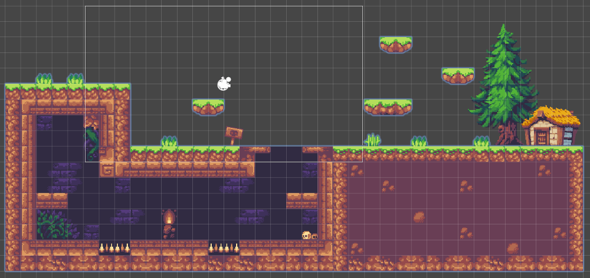

#### C.E. DVRV

### Programación y Motores de Videojuegos

#### Project: Sunny

`[Unity ver.: 6.2.8f1]`

## Diseño

### Concepto

- **Título:** Sunny

- **Plataforma:** PC

- **Género:** Plataformas

- **Cámara:** Juego 2D con scroll lateral

- **Descripción:**

  - Juego para un jugador en el que el objetivo es manejar un personaje en un escenario, evitando obstáculos y enemigos, recolectando la mayor cantidad de tesoros posibles hasta alcanzar la salida.

### Elementos de diseño

### Mapa

### Mecánicas

- El jugador maneja su personaje en cualquier dirección, sin poder abandonar la zona de juego.

- Podrá realizar acciones como correr, saltar, subir escaleras,... cada una representada con su correspondiente animación.

- El escenario planteará un recorrido lineal, con principio y fin, pero existirán diversas zonas de exploración fuera de dicho recorrido principal.

- El recorrido estará salteado de retos que pongan a prueba la habilidad del jugador.

- Habrá diferentes enemigos con diferentes comportamientos.

- En las áreas de exploración habrá diferentes items (coleccionables, _power-ups_,...) que premiarán al jugador.

- Existirá una música ambiente y efectos sonoros para las acciones o situaciones más relevantes.
